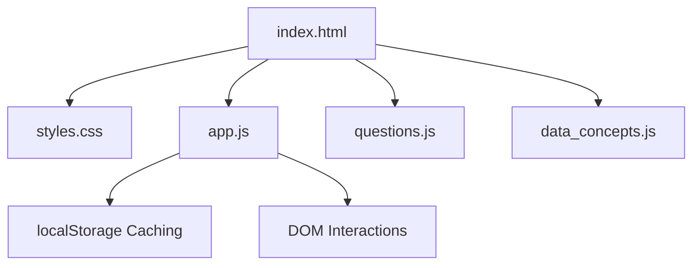

# Development, Testing, & Operations Guide

Welcome to the Microsoft Fabric & Power BI Interview Prep portal development guide. This document details the architectural decisions, foolproof mechanisms, testing workflows, and best practices that make this website stable, robust, and friendly to millions of concurrent users.

---

## 1. Project Architecture

This application is built as a premium, Apple-inspired Single Page Application (SPA) utilizing vanilla HTML5, modern client-side JavaScript, and CSS variables. It requires zero compilation or backend server resources, meaning it can scale to millions of concurrent users with 100% availability via a static file host (like Vercel or GitHub Pages).

### Architecture Map


- **`index.html`**: Defines the main application structure, semantic layout grids, and horizontal filter stacks (`.qa-hfilter-stack`).
- **`styles.css`**: Features responsive, apple-inspired layout grids, dark/light theme support, glassmorphism card variables, and horizontal/vertical scroll wrappers.
- **`app.js`**: Core controller containing routing lifecycle, state management, event listeners, dynamic filters, rendering loops, and stats mapping.
- **`questions.js`**: Automatically compiled JSON question records (~1.2MB).
- **`data_concepts.js`**: Interactive data defining architectural terms and definitions sorted by difficulty.

---

## 2. Multi-User Friendliness & Local Cache Insulation

Because the website is 100% client-side, it is inherently **multi-user friendly** out of the box. No user sessions interfere with others, and user data is never leaked or stored in a shared database.

### Progress Tracking & Theme Preferences
- **Insulated State**: Questions marked as *Unseen*, *Reviewing*, or *Mastered* are saved securely in the user's browser via `localStorage`.
- **System Theme Matching**: Theme switching stores preference (`dark`/`light`) in the client's browser local cache, ensuring zero page flickering on load.
- **Robust LocalStorage Safe-Guards**: State reads are wrapped in `try/catch` blocks to prevent crashes if a user blocks local storage or runs in strict privacy mode (incognito).

---

## 3. Foolproof Data Compilation & Schema Validation

To prevent database syntax mistakes or formatting errors from taking down the live website, we enforce a compilation and validation pipeline.

### Database Compilation (`data/*.toon` & JSON)
All source databases are compiled down to optimized Javascript variables using compilation tooling:
```bash
python3 scripts/compile_db.py
```

### Automatic Verification Checks
Before pushing to production, developer scripts validate:
1. **Uniqueness**: No duplicate question IDs.
2. **Required Fields**: Every entry must contain an `id`, `category`, `niche`, `question`, and `answer`.
3. **Category Constraints**: Ensures balanced questions across topics.

---

## 4. Advanced Testing & Verification Suite

Our testing framework consists of multiple layers of automated testing, combining JSDOM and Puppeteer.

### Test Categories
1. **Portal Data Integrity (`tests/test_portal.js`)**: Structural checking of JSON schema, duplicate checks, and distribution rules.
2. **Concept Explainer (`tests/test_explainer.js`)**: Interactive search, debounces, and accordion toggle validation.
3. **DE Cheat Sheet (`tests/test_cheatsheet.js`)**: Lang switches, tab active highlights, comparison tables.
4. **Key Concepts Glossary (`tests/test_concepts.js`)**: Validates sorting logic (`EASY` -> `MEDIUM` -> `HARD`), category filters, search filters.
5. **Hyderabad GCC Directory (`tests/test_gcc.js`)**: Checks search matching, risk tier filtering, and table rows display.
6. **E2E Puppeteer (`tests/test_ui.js`)**: Visual layout transitions, clicking interactions, and viewport responsiveness.

### Running the Test Suite
Ensure the local development server is running in the background:
```bash
# Run all automated JSDOM and Puppeteer tests
npm test
```

---

## 5. Operations & Release Guidelines

To publish a new version of the website safely:
1. Update database records inside the `data/` directory or update components in `index.html`.
2. Regenerate database script: `python3 scripts/compile_db.py`.
3. Run the validation checks: `npm test`.
4. Deploy the production build: `npm run deploy` (or `npx vercel --prod`).
