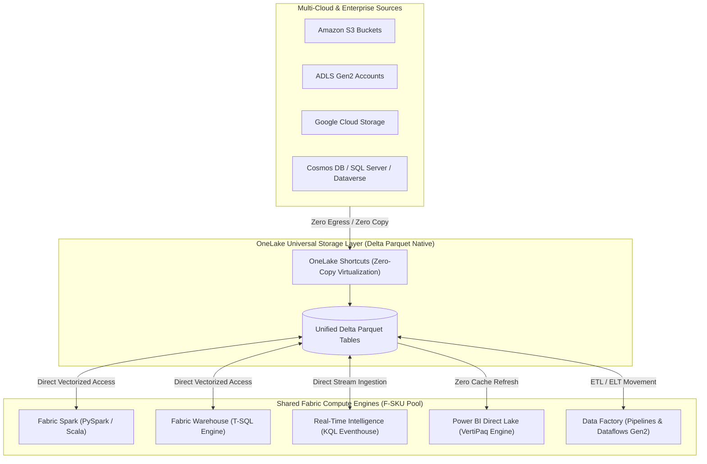
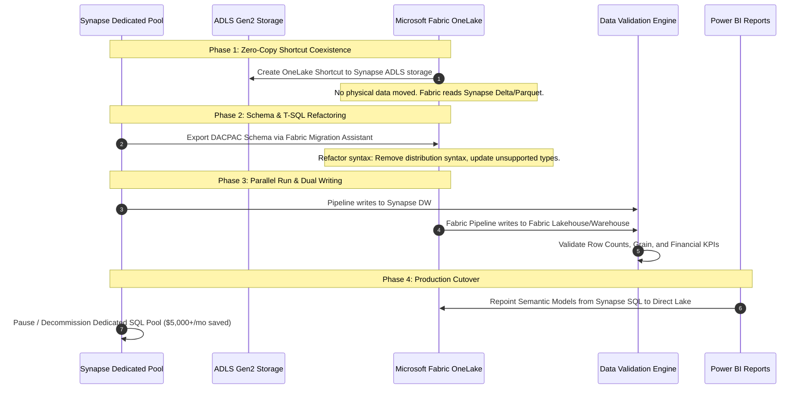

# Module 02: Microsoft Fabric Architectural Mastery

## 1. The Generative Shift: PaaS Fragmented Stacks vs SaaS OneLake

Traditional enterprise data architectures on Azure required stitching together 5 to 8 disparate PaaS services: Azure Data Factory for ingestion, ADLS Gen2 for raw storage, Azure Synapse or Databricks for compute, Azure Key Vault for secrets, Azure Purview for cataloging, and Power BI Premium for reporting. Each service required independent provisioning, networking perimeters (Private Link, VNet peerings), authentication handshakes, and storage formatting conversions.

**Microsoft Fabric** consolidates this entire lifecycle into a unified **Software-as-a-Service (SaaS)** architecture powered by a single tenant-wide storage foundation: **OneLake**.



---

## 2. OneLake Architecture & The Shortcut Pattern

OneLake is often called the *"OneDrive for Data"*. Every Microsoft 365 and Fabric tenant has exactly one OneLake, eliminating data silos between departments.

### 2.1 Delta Parquet as the Universal Format
Every compute engine in Fabric (Spark, Warehouse, Power BI, KQL) reads and writes the exact same underlying open format: **Delta Lake (Parquet with ACID transaction logs)**. 
- When Fabric Spark writes a table, the Fabric SQL Warehouse can immediately query it without data movement or external table definitions.
- Power BI reads the exact same Delta parquet files into memory via **Direct Lake**.

### 2.2 OneLake Shortcuts: Eliminating Egress & Storage Duplication
Shortcuts are embedded symbolic links in OneLake that point to internal or external storage locations without copying physical data:
- **External S3 / GCS Shortcuts**: Data in AWS S3 is exposed inside a Fabric Lakehouse as if it were a local folder.
- **Cross-Workspace Shortcuts**: Marketing can shortcut Finance's Gold Delta tables without granting Finance workspace admin access or duplicating storage bills.
- **Enterprise Benefit**: Zero replication lag, zero duplicate storage costs, zero network egress charges.

---

## 3. Lakehouse vs. Data Warehouse in Fabric: Architectural Decision Matrix

Architects frequently face the choice of whether to provision a Fabric Lakehouse or a Fabric Warehouse:

| Capability | Fabric Lakehouse | Fabric Data Warehouse | Architectural Recommendation |
| :--- | :--- | :--- | :--- |
| **Primary Persona** | Data Engineers, Data Scientists, Spark Specialists | BI Developers, SQL Engineers, Enterprise DW Architects | Choose **Lakehouse** for unstructured/semi-structured data and machine learning; choose **Warehouse** for enterprise relational modeling. |
| **Compute Engine** | Apache Spark (PySpark, Scala, R) + SQL Analytics Endpoint (Read-Only) | Distributed ACID T-SQL Engine (Read & Write) | Use Lakehouse for raw-to-silver medallion engineering; use Warehouse for consumer-facing gold star schemas. |
| **Table Structure** | Supports both Managed/External **Tables** and unstructured **Files** (CSV, JSON, Images, Audio) | Tables only (strongly typed relational schemas) | Lakehouse is required if audio/video/unstructured telemetry is part of the pipeline. |
| **Transactions & DDL** | Spark ACID (Delta transaction log). DDL executed via Spark SQL. | Full Multi-table ACID Transactions, cross-database queries, traditional T-SQL DDL/DML. | Choose Warehouse if complex stored procedures and transactional rollbacks are strict requirements. |
| **Security Model** | Workspace-level, OneLake data access roles, folder/table permissions. | Granular T-SQL security: **Row-Level Security (RLS)**, **Column-Level Security (CLS)**, and Dynamic Data Masking. | Warehouse provides superior native RBAC for sensitive BI consumption layers. |

---

## 4. Power BI Direct Lake Mode: Deep-Dive & Tuning

Direct Lake mode is Fabric's flagship breakthrough in business intelligence performance, bridging the gap between Import and DirectQuery modes.

```mermaid
flowchart LR
    subgraph Traditional_PBI["Traditional BI Bottlenecks"]
        ADLS_Old[(Data Lake)] -->|Slow Scheduled Refresh (Overnight)| ImportCache[VertiPaq In-Memory Cache]
        SQL_Old[(Synapse SQL)] -->|Slow On-the-Fly SQL Translation| DQ[DirectQuery Translation Engine]
    end

    subgraph DirectLake_Mode["Fabric Direct Lake Architecture"]
        OneLake[(OneLake Delta Parquet)] -->|Zero ETL / Sub-second Load| PBI_Memory[VertiPaq Memory Directly Pages Delta Columns]
        PBI_Memory --> Dash[Interactive Executive Report]
    end
```

### 4.1 How Direct Lake Works
1. Power BI's **VertiPaq engine** natively reads Delta Parquet column chunks directly from OneLake storage into memory on demand.
2. No data is duplicated into a separate `.pbix` model cache.
3. When data changes in OneLake (e.g., a Spark streaming batch commits a new Delta version), Power BI visuals reflect the updated data instantly on next interaction without waiting for overnight ETL refreshes.

### 4.2 Preventing the DirectQuery Fallback
If a Direct Lake query exceeds its memory envelope or encounters unsupported features, Fabric automatically falls back to **DirectQuery mode**, which translates DAX into SQL queries and severely degrades dashboard performance.

**Top Fallback Triggers & Production Prevention**:
- **Row-Level Security (RLS) on Lakehouse**: Lakehouse SQL endpoints do not yet fully support Direct Lake RLS. *Solution*: Apply RLS in the Fabric Data Warehouse or define RLS directly in the Power BI Semantic Model.
- **Exceeding F-SKU Model Memory Limits**: An F64 capacity allows up to 25GB in-memory model size per query. If a model exceeds this, fallback occurs. *Solution*: Apply column pruning in Gold layers, convert high-cardinality decimal strings to numeric keys, and implement incremental aggregations.
- **Complex Calculated Columns in DAX**: DAX calculated columns cannot be vectorized directly from Delta Parquet. *Solution*: Pre-compute all calculated columns upstream in Spark or dbt during Silver/Gold transformation.

---

## 5. Capacity Management: F-SKUs, Smoothing & Bursting

Fabric does not bill by virtual machines or individual services; it bills against **Fabric Capacity Units (CUs)** packaged into **F-SKUs** (from F2 up to F2048):
- **1 CU** $\approx$ the computational power of 2 Azure vCPUs.
- An **F64 capacity** provides 64 CUs (equivalent to Power BI Premium P1), which unlocks free consumption for Power BI Free users across the tenant.

### 5.1 The Smoothing Algorithm: Defeating Peak Spikes
In traditional cloud platforms, running a heavy ETL job for 10 minutes that requires 64 cores requires provisioning a 64-core cluster, paying the maximum rate even if the cluster is idle for the remaining 50 minutes.

Fabric introduces **Smoothing**:
- Computations are categorized into **Interactive** (Power BI visuals, notebook execution) and **Background** (scheduled Data Factory pipelines, Spark batch jobs).
- Background job consumption is automatically smoothed over a **24-hour moving window**.
- A 10-minute heavy pipeline using 2,400 CU-seconds is divided across 24 hours ($2,400 / 86,400 = 0.027$ CUs/sec), preventing capacity throttling and allowing smaller, cheaper F-SKUs to handle massive batch transformations.

### 5.2 Capacity Throttling & Automated FinOps Runbook
When continuous consumption exceeds 100% of capacity over the evaluation window, Fabric applies three progressive throttle stages:
1. **Interactive Delay** (60s delay on visual queries).
2. **Interactive Rejection** (visual queries fail; scheduled background jobs continue).
3. **Total Rejection** (all jobs blocked).

**Production FinOps Automated Pause/Resume Script (Azure Logic Apps / Azure CLI)**:
Non-production environments (Dev/Test) should never run 24/7. An F64 running continuously costs $\approx \$5,000/\text{month}$. Pausing outside business hours (7 PM to 7 AM + weekends) reduces the monthly cost to $\approx \$1,500/\text{month}$ (70% savings):
```bash
# Pause non-production Fabric Capacity at 19:00 UTC
az fabric capacity suspend \
  --resource-group rg-fabric-dev-eastus \
  --capacity-name capfabricdev01

# Resume at 07:00 UTC
az fabric capacity resume \
  --resource-group rg-fabric-dev-eastus \
  --capacity-name capfabricdev01
```

---

## 6. Migration Playbook: Synapse Dedicated SQL to Fabric

Migrating from Azure Synapse to Microsoft Fabric requires a structured, phased approach rather than a high-risk lift-and-shift.



### 6.1 Top T-SQL Refactoring Requirements
When moving DDL from Synapse Dedicated SQL Pools to Fabric Warehouse:
1. **Remove Distribution Clauses**: Fabric handles distributed storage automatically. Remove `WITH (DISTRIBUTION = HASH(...), CLUSTERED COLUMNSTORE INDEX)`.
2. **Remove Partitioning Constraints on Small Tables**: In Fabric, Delta Lake micro-partitioning handles indexing via V-Order. Manual partition schemes are only recommended for tables $>1\text{TB}$.
3. **Refactor Unsupported Syntax**: Convert `IDENTITY` columns to surrogate key generation via Spark `monotonically_increasing_id()` or Window functions if strict sequential integrity is not required.
