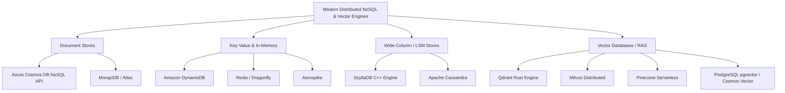
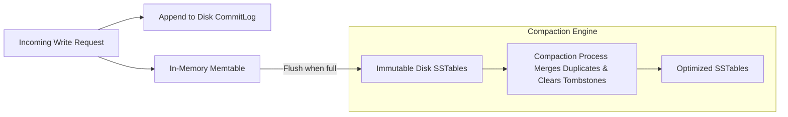
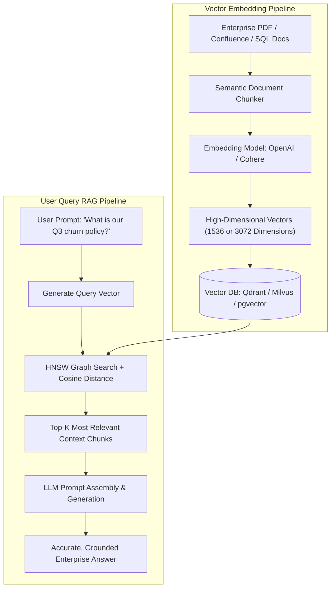

# Module 03: Modern NoSQL & Vector Databases at Scale

## 1. Modern NoSQL Taxonomies & Landscape

Modern data architectures diverge sharply from monolithic RDBMS by utilizing **purpose-built NoSQL and Vector data stores** optimized for specific access patterns, ultra-low latency SLAs, and petabyte-scale horizontal elasticity.



---

## 2. Azure Cosmos DB: Deep-Dive & FinOps RU/s Optimization

Azure Cosmos DB is a globally distributed, multi-model NoSQL database offering single-digit millisecond latency SLAs at the 99th percentile with five well-defined consistency levels (Strong, Bounded Staleness, Session, Consistent Prefix, Eventual).

### 2.1 The Request Unit (RU/s) Financial Equation
Every operation in Cosmos DB (reads, writes, queries, stored procedures) consumes **Request Units (RUs)**:
- **Point Read (1 KB item)** = Exactly **1.0 RU**.
- **Point Write (1 KB item)** = Approximately **5.0 to 10.0 RUs** (due to quorum consensus write replication across 4 local replicas and automatic indexing of all JSON properties).
- **Unbounded SQL Query with String Contains**: Can easily consume **1,500+ RUs per execution**.

```
Monthly Cost Equation (Provisioned Capacity):
Monthly Cost ($) = (Total Provisioned RU/s / 100) * $0.008 * 730 hours
Example: Provisioning 50,000 RU/s = 500 * $0.008 * 730 = $2,920/month per region!
```

### 2.2 Sizing Models: Serverless vs. Autoscale vs. Standard Provisioned

| Tier | Best For | Behavior & Limits | Cost Comparison |
| :--- | :--- | :--- | :--- |
| **Serverless** | Development, non-prod, sporadic workloads (<1M requests/day). | Billed strictly per RU consumed (\$0.25 per 1M RUs). Capped at 50GB storage and 5,000 RU/s burst. | **Cheapest for bursty/idle traffic** (saves 90% vs provisioned). |
| **Autoscale** | Production workloads with unpredictable spikes or cyclic diurnal traffic (e.g. e-commerce). | Set a max RU (e.g., 10,000 RU/s). Cosmos instantly scales between 10% (1,000 RU/s) and 100% based on load. Billed hourly at peak used. | **Saves 50–70%** compared to over-provisioned static capacity. |
| **Standard Provisioned** | Predictable, continuous high-throughput streams (e.g. IoT telemetry, banking ledger). | Fixed RU/s allocated 24/7. Continuous billing regardless of utilization. | Lowest unit cost per RU if sustained utilization exceeds 75%. |

### 2.3 Partition Key Strategy: Defeating the Hot Partition Trap
Every Cosmos DB container has a physical partition limit of **50 GB** and **10,000 RU/s**. 
- **Anti-Pattern (Hot Partition)**: Partitioning by `TenantType` (where 'Enterprise' represents 90% of traffic). The physical partition hosting 'Enterprise' saturates its 10,000 RU/s and responds with `HTTP 429 (Too Many Requests)`, even though the container has 50,000 total RU/s provisioned.
- **Production Solution (Synthetic Partition Keys)**: Combine the tenant ID with a randomized or deterministic hash suffix:
$$\text{PartitionKey} = \text{TenantId} + \text{"\_"} + (\text{UserId} \pmod{10})$$
This evenly scatters write traffic across 10 distinct physical partitions.

### 2.4 Cosmos DB Change Feed: Event-Driven Streaming
The Change Feed outputs an immutable log of document inserts and updates in the order they occurred. 
- Integrated natively with **Azure Functions** and **Azure Event Hubs**.
- Powers zero-ETL real-time projections: when an order document is updated in Cosmos DB, the Change Feed pushes the diff directly to downstream materialized views, search indexes, or fraud detection ML models.

---

## 3. High-Throughput Wide-Column: Cassandra vs. ScyllaDB

Wide-column stores excel at write-heavy workloads (100,000+ writes/second) such as telemetry ingestion, financial tickers, and sensor tracking.



### 3.1 Why ScyllaDB Replaces Apache Cassandra in High-Scale Architectures
- **The JVM Garbage Collection Problem**: Apache Cassandra is written in Java. Under sustained 100K+ ops/sec, JVM stop-the-world Garbage Collection pauses create tail latency spikes ($p99 > 500\text{ms}$).
- **The ScyllaDB Solution**: Written in C++ using the **Seastar asynchronous framework**. It uses a **thread-per-core (shared-nothing)** architecture that bypasses OS context switches, locks, and JVM GC entirely, maintaining sub-millisecond $p99$ latencies on 10x fewer servers.

### 3.2 The Tombstone Anti-Pattern in Wide-Column Stores
In LSM-based databases, a `DELETE` statement does not physically delete data; it writes a special deletion marker called a **Tombstone**:
- If an application continuously inserts and deletes rows (e.g., managing an active queue), queries scanning the table must read millions of tombstones into memory before returning matching rows.
- **Result**: `TombstoneOverwhelmingException` and node crashes.
- **Production Solution**: Never use Cassandra/ScyllaDB as a message queue. For expiring data, rely on native **TTL (Time-To-Live)** and configure the **Time Window Compaction Strategy (TWCS)** to drop entire SSTables at expiration.

---

## 4. Vector Databases for Enterprise AI & RAG Architectures

The explosion of Large Language Models (LLMs) and Retrieval-Augmented Generation (RAG) has elevated Vector Databases into core enterprise infrastructure.



### 4.1 Vector Indexing Algorithms: HNSW vs. IVF

| Algorithm | Index Construction Speed | Search Query Latency | Memory Footprint | Recall Accuracy |
| :--- | :--- | :--- | :--- | :--- |
| **HNSW (Hierarchical Navigable Small World)** | Slow (builds complex multi-layer graph structures). | **Ultra-Low (<5ms)**; navigates interconnected skip-list graphs. | **High** (graph edges must reside entirely in RAM). | **95–99%** (Best-in-class recall). |
| **IVF (Inverted File Index)** | Fast (clusters vectors into Voronoi cells via k-means). | Medium (must search centroids, then scan vectors within selected cells). | **Low to Moderate** (can be combined with Product Quantization). | **85–92%** (Fast, but can miss edge candidates). |

### 4.2 Dedicated Vector DBs (Qdrant/Milvus) vs. Relational Extensions (pgvector)
Architectural decision guide:
1. **Choose `pgvector` (PostgreSQL)** if:
   - Your dataset contains $<1\text{M}$ vectors.
   - You already run managed PostgreSQL (e.g., Azure Database for PostgreSQL).
   - Strict transactional consistency between relational business data and vector embeddings is required in a single SQL query.
2. **Choose Dedicated (Qdrant / Milvus / Pinecone)** if:
   - Your dataset exceeds $10\text{M}$ vectors.
   - You require real-time streaming updates with sub-10ms query latencies under high concurrency (>500 QPS).
   - Advanced payload filtering (e.g., filtering vectors by tenant ID, date ranges, and permission tags simultaneously via single-stage hybrid search) is required.

---

## 5. Summary: Multi-Database Architecture Selection Matrix

| Workload Requirement | Optimal Database Engine | Key Architectural Feature | Bottleneck to Watch |
| :--- | :--- | :--- | :--- |
| **Global User Profiles & E-commerce Carts** | Azure Cosmos DB (NoSQL API) | Multi-region active-active writes, sub-10ms latency SLAs. | Hot partition throttling; uncontrolled query RU consumption. |
| **High-Scale IoT Telemetry & Sensor Ingestion** | ScyllaDB / Apache Cassandra | LSM tree architecture, 100K+ writes/sec per node. | Tombstone accumulation; improper compaction strategy. |
| **High-Speed Session State & Feature Caching** | Redis / Dragonfly / Aerospike | In-memory key-value storage, sub-millisecond retrieval. | RAM cost exhaustion; persistence snapshot latency spikes. |
| **Enterprise RAG & Semantic Document Search** | Qdrant / pgvector / Milvus | HNSW graph vector indexing, cosine similarity distance. | High RAM consumption for HNSW graphs; metadata filter overhead. |
