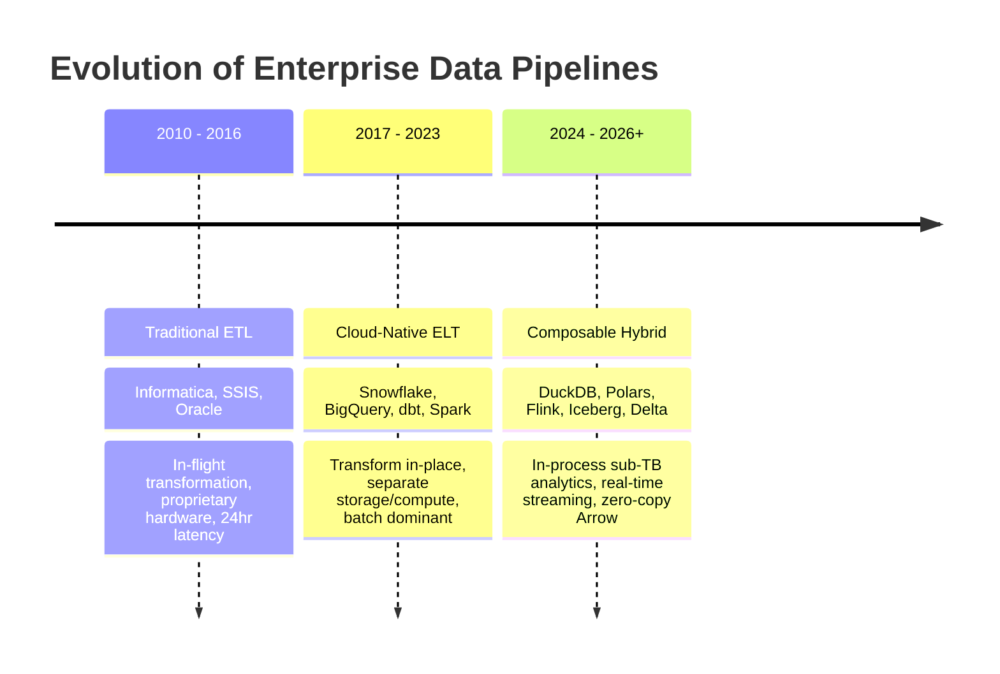
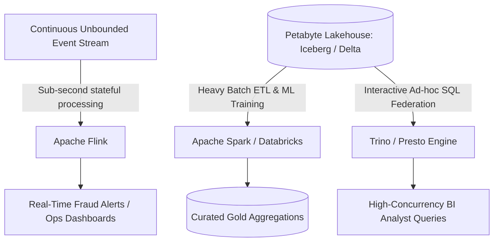
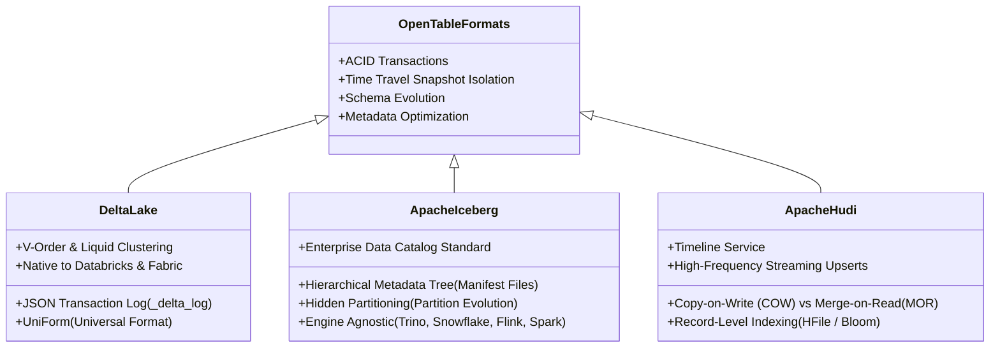

# Module 04: Modern ETL/ELT & Stream Processing at Scale

## 1. The Modern Data Stack Evolution: From ETL to In-Process & Streaming Hybrid

The traditional ETL paradigm—where data was extracted, transformed on dedicated compute servers (Informatica, SSIS), and loaded into rigid data warehouses—has evolved through three distinct waves:



### 1.1 The "De-Clustering" Movement (DuckDB & Polars)
For years, data engineering teams suffered from **"Spark Reflex"**—spinning up a 16-node distributed Spark cluster to process a 15GB CSV file. This incurred 5-minute cluster spin-up delays, distributed network shuffle overhead, and \$30–\$50 per run in cloud infrastructure bills.

In modern architectures, **single-node in-process engines** handle datasets from megabytes up to hundreds of gigabytes faster than distributed clusters at 95% lower cost:
- **DuckDB**: An embedded, columnar C++ analytical database. It reads Parquet/Delta files directly from local disk or S3/ADLS using vectorized execution, processing tens of millions of rows in seconds on a developer laptop or small VM.
- **Polars**: A blazingly fast DataFrame library written in Rust. It utilizes multi-threaded parallel execution across all CPU cores and represents memory using the **Apache Arrow** columnar format.
- **Zero-Copy Arrow Interoperability**: Polars and DuckDB exchange memory pointers via the Apache Arrow C Data Interface with **zero serialization overhead**, allowing developers to mix Polars DataFrame operations with DuckDB SQL queries effortlessly.

---

## 2. Distributed Compute Engines: Spark vs. Flink vs. Trino

When data volumes expand from gigabytes to tens or hundreds of terabytes, distributed engines become necessary:



| Engine | Execution Model | Optimal Workload | Primary Strength | Weakness / Limitation |
| :--- | :--- | :--- | :--- | :--- |
| **Apache Spark** | Micro-batch (Structured Streaming) & Batch Distributed DAG | Petabyte batch ETL, machine learning feature engineering, heavy multi-table joins. | Massive ecosystem, mature ACID Delta/Iceberg integration, Catalyst & AQE optimizers. | High latency for streaming (typically 100ms–1s micro-batches); heavy JVM memory footprint. |
| **Apache Flink** | True Streaming (Event-by-event) with RocksDB state backend | Real-time fraud detection, complex event processing (CEP), sub-second streaming metrics. | Exact-once stateful processing, native event-time windowing, sub-second latency. | Complex state management and checkpoint tuning; steep operational learning curve. |
| **Trino (Presto)** | MPP In-Memory Interactive Query Engine | Interactive ad-hoc querying across heterogeneous sources without ETL. | Blazing fast analytical query response times across S3, Iceberg, PostgreSQL, Kafka. | Not an ETL engine; long-running batch jobs with memory spills fail without fault tolerance. |

---

## 3. The Open Table Format Wars: Delta Lake vs. Apache Iceberg vs. Apache Hudi

The foundation of the modern lakehouse is the **Open Table Format**, which brings database capabilities (ACID transactions, time travel, schema evolution) to cloud object storage (Parquet).



### 3.1 Architectural Comparison

| Architectural Feature | Apache Iceberg | Delta Lake (with UniForm) | Apache Hudi |
| :--- | :--- | :--- | :--- |
| **Metadata Mechanism** | **Hierarchical Snapshot Tree**: `metadata.json` $\to$ Manifest Lists $\to$ Manifest Files $\to$ Data Files. | **Sequential Log**: `000000.json` commits checkpointed into Parquet files every 10 commits. | **Timeline**: In-storage log of actions (commits, cleans, compactions). |
| **Partitioning Strategy** | **Hidden Partitioning**: Partitions evolve seamlessly without rewriting table history or changing query SQL predicates. | Traditional directory partitioning (`/year=2024/month=01/`) or modern **Liquid Clustering**. | Hive-style directory partitioning with key-based indexing. |
| **Ecosystem Neutrality** | **Engine Agnostic**: Supported natively with first-class parity in Snowflake, Trino, Flink, Spark, BigQuery. | Heavily optimized for **Databricks and Microsoft Fabric**, but supports external engines via UniForm. | Historically optimized for Spark and EMR streaming pipelines. |
| **Streaming Upsert Performance** | Good (supports row-level deletions via positional/equality deletes). | Good (native `MERGE INTO` with low-shuffle merge). | **Best-in-Class**: Merge-On-Read (MOR) with record-level indexing writes micro-updates in seconds. |

---

## 4. Modern Orchestration: Airflow vs. Dagster

Data orchestration has shifted from simple workflow scheduling to **data-aware lifecycle orchestration**.

### 4.1 Apache Airflow (The Workflow Orchestrator)
- **Model**: Task-centric DAGs (Directed Acyclic Graphs).
- **How It Thinks**: *"Run Step A, then if Step A finishes, run Step B."*
- **Best For**: Multi-system operational automation, triggering external cloud jobs (Databricks, Snowflake, Synapse), legacy pipeline orchestration.
- **Weakness**: Airflow knows nothing about the data itself; it only knows whether a bash script or Python operator returned exit code 0.

### 4.2 Dagster (The Data-Aware Orchestrator)
- **Model**: **Software-Defined Assets (SDAs)**.
- **How It Thinks**: *"We need to produce asset `gold_monthly_revenue`. To produce this asset, we need `silver_orders` and `silver_customers`."*
- **Best For**: Modern Lakehouses, dbt-centric architectures, machine learning feature stores, platforms requiring automatic lineage and partition-aware backfills.
- **Superpower**: Declarative Scheduling. If upstream raw data arrives late, Dagster automatically identifies only the downstream assets that are stale and executes targeted recalculations.

---

## 5. Modern Data Transformation: dbt (Data Build Tool) at Scale

dbt has become the de-facto standard for transformation in the modern data stack by applying software engineering best practices (version control, automated testing, documentation, modularization) to SQL.

### 5.1 Incremental Materialization Strategies
Full table refreshes on multi-billion row tables are financially prohibitive. dbt provides four core incremental strategies:

```sql
{{ config(
    materialized = 'incremental',
    unique_key = 'order_id',
    incremental_strategy = 'merge'
) }}

SELECT 
    order_id,
    customer_id,
    order_status,
    total_amount,
    updated_at
FROM {{ ref('stg_orders') }}


  -- Only scan raw records modified within the last 3 days to handle late-arriving data
  WHERE updated_at >= (SELECT DATEADD(day, -3, MAX(updated_at)) FROM {{ this }})

```

### 5.2 dbt Mesh: Enterprise Governance for Decentralized Teams
In large organizations, monolithic dbt repositories become unmanageable (1,500+ models, 45-minute compilation times, constant merge conflicts).
**dbt Mesh** enables a **Data Mesh** architecture:
- Each business domain (Marketing, Finance, Supply Chain) maintains its own independent dbt project.
- Upstream projects declare **Public Models** protected by **Model Contracts** (strict schema enforcement).
- Downstream projects query upstream models using cross-project references (`{{ ref('finance_project', 'dim_customers') }}`) without having access to internal staging logic.
