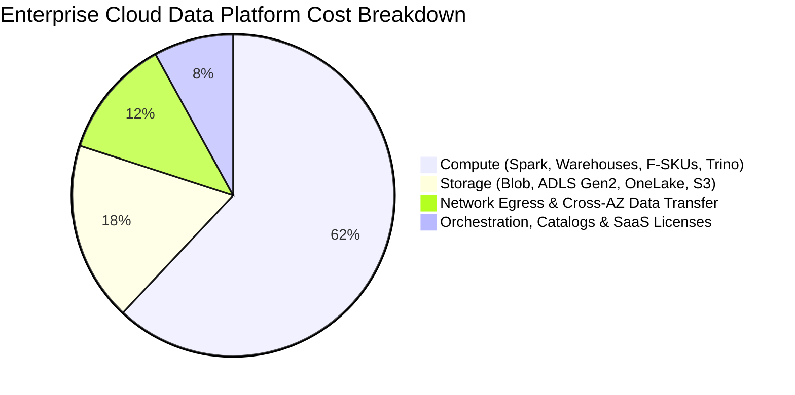
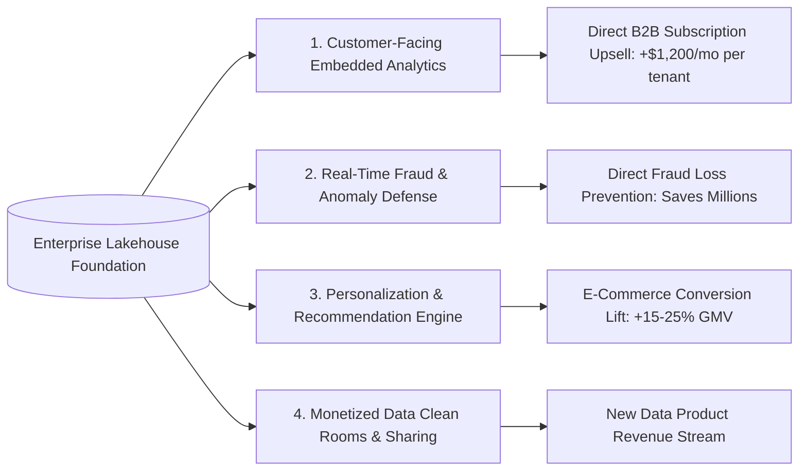

# Module 05: Big Data FinOps: Cost-Effective & Revenue-Generating Architectures

## 1. The Total Cost of Ownership (TCO) Reality in Modern Data Platforms

In enterprise cloud environments, unchecked data platform spending is one of the fastest-growing line items. A typical enterprise big data budget breaks down into four primary cost centers:



### 1.1 The Serverless vs. Provisioned Break-Even Mathematical Model
Architects must determine whether to deploy **Serverless (pay-per-query/pay-per-scan)** or **Provisioned (reserved capacity/standing clusters)**:

$$\text{Monthly Cost}_{\text{Serverless}} = \text{Data Scanned (TB)} \times \$5.00$$

$$\text{Monthly Cost}_{\text{Provisioned (e.g. F64)}} = \text{Capacity Rate (\$8.40/hr)} \times 730\text{ hrs} \times (1 - \text{RI Discount}) \approx \$4,200\text{ to }\$6,132$$

$$\text{Break-Even Point (TB Scanned/Month)} = \frac{\$6,132}{\$5.00} = 1,226.4\text{ TB/month} \approx 40.8\text{ TB/day}$$

**Architectural Decision Rule**:
- If total analytical queries scan **less than 40 TB per day**, a **Serverless model** (Synapse Serverless, Athena, BigQuery on-demand) is drastically more cost-effective.
- If total analytical queries scan **more than 40 TB per day** with consistent concurrency, **Provisioned/Reserved Capacity** (Fabric F64+, Snowflake pre-purchased capacity, Databricks Reserved Instances) yields up to 60% lower unit cost per query.

---

## 2. Storage Tiering & Compaction FinOps Playbook

Storage costs compound exponentially over time if retention policies are neglected:

```mermaid
flowchart TD
    BronzeRaw[Bronze Raw Landing: ADLS / S3] -->|Day 0-30: Hot Tier ($0.018/GB)| HotStorage[Hot Storage Tier]
    HotStorage -->|After 30 Days: Move to Cool ($0.010/GB)| CoolStorage[Cool Storage Tier]
    CoolStorage -->|After 90 Days: Move to Cold ($0.0036/GB)| ColdStorage[Cold Storage Tier]
    ColdStorage -->|After 365 Days: Move to Archive ($0.00099/GB)| ArchiveStorage[Archive / Glacier Tier]
    ArchiveStorage -->|After 7 Years: Regulatory Purge| DeleteNode[Permanent Deletion]
```

### 2.1 The ZSTD vs. Snappy Compression Benchmark
- **Snappy**: The default compression algorithm for Apache Spark and Parquet. Fast compression and decompression speed, but moderate compression ratio ($3:1$).
- **Zstandard (ZSTD)**: The modern standard for cold/curated storage. It provides a $5:1$ or $6:1$ compression ratio with near-Snappy decompression speeds.
- **FinOps Impact**: Re-compressing historical Gold/Silver Parquet partitions with ZSTD level 7 reduces storage footprint by **35% to 45%**, immediately cutting storage bills on petabyte datasets.

### 2.2 Delta Lake / Iceberg Vacuuming & Orphan File Pruning
Every `UPDATE`, `DELETE`, or `MERGE` in a Lakehouse creates new Parquet files without immediately deleting the old versions (enabling snapshot isolation and time travel).
If table cleanup is omitted, the storage layer retains hundreds of unreferenced historical files.

```sql
-- 1. Optimize and Compact small files into ideal 128MB-512MB chunks
OPTIMIZE gold.fact_orders ZORDER BY (customer_id, order_date);

-- 2. Purge transaction log history older than 7 days (168 hours)
VACUUM gold.fact_orders RETAIN 168 HOURS;
```
*FinOps Warning*: Never run `VACUUM` with 0 hours retention in production, as active concurrent reads will immediately crash with `FileNotFoundException`.

---

## 3. High Revenue-Generating Data Architectures

Modern data platforms should not merely act as internal cost centers for static reporting; they should drive top-line enterprise revenue.



### 3.1 Customer-Facing Embedded Analytics (B2B SaaS Monetization)
Instead of delivering data only to internal executives, SaaS platforms package operational insights back to their paying customers:
- **Architectural Pattern**:
  1. Multitenant Gold tables stored in Delta/Iceberg.
  2. Strict Row-Level Security (RLS) dynamically filtering by `TenantId`.
  3. Low-latency caching layer (Redis / DuckDB / Trino) providing sub-200ms API responses.
  4. Embedded Power BI or lightweight React charts embedded directly inside the customer web application.
- **Revenue Model**: B2B SaaS companies monetize this as a **"Premium Analytics Add-on"** ($500 to $2,500/month per enterprise customer), turning the data engineering team into a direct profit center.

### 3.2 Real-Time Fraud Prevention & Risk Scoring
- **Financial Architecture**: Payment authorization events stream from POS systems into **Azure Event Hubs / Kafka**, processed in real time by **Apache Flink** or **Databricks Structured Streaming**.
- ML models compute risk scores against Cosmos DB historical user feature stores in $<50\text{ms}$.
- **Revenue Impact**: Prevents credit card fraud, chargeback penalties, and account takeover losses, delivering measurable multimillion-dollar ROI.

---

## 4. The Blueprint: 10TB/Day Platform for Under $3,000/Month

How a high-growth data organization can run a massive 10TB/day data platform on a fraction of traditional enterprise budgets:

| Component | Traditional High-Cost Stack | Ultra-Cost-Effective Modern Architecture | Monthly Cost |
| :--- | :--- | :--- | :--- |
| **Ingestion** | Managed SaaS (Fivetran / Airbyte Cloud) at $1/credit | Open-source Airbyte / Debezium CDC running on spot VMs | \$220 |
| **Storage** | Premium SSD RDBMS / Snowflake Storage | ADLS Gen2 / S3 standard storage with ZSTD compression | \$380 |
| **Heavy Pre-filtering** | Continuous 16-node Spark clusters | In-process DuckDB + Polars containers on Spot Instances | \$450 |
| **Gold Transformations**| Proprietary Data Warehouse (DW2000c) | Serverless dbt-core + DuckDB / Spot Databricks Single-node | \$650 |
| **Ad-Hoc Querying** | Always-on Dedicated SQL Pool | Synapse Serverless SQL + DuckDB memory caching | \$400 |
| **Orchestration** | Managed Enterprise Orchestrator | Self-hosted Dagster / Airflow on lightweight Kubernetes | \$180 |
| **Total Estimated Spend**| **\$22,000 – \$35,000/month** | **Target Architecture** | **$\approx \$2,280$/month** |
