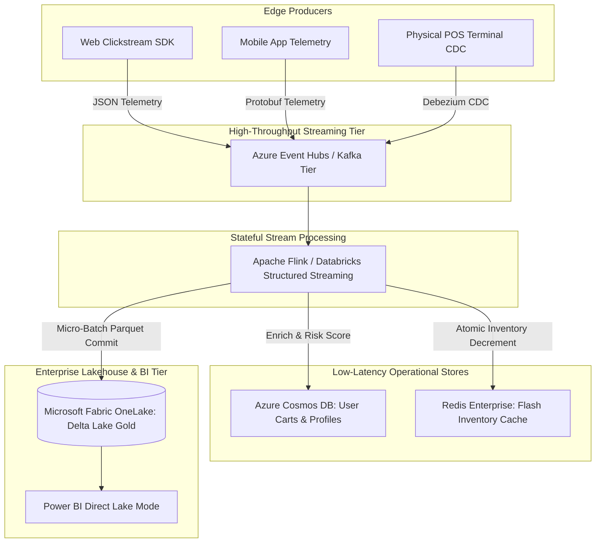
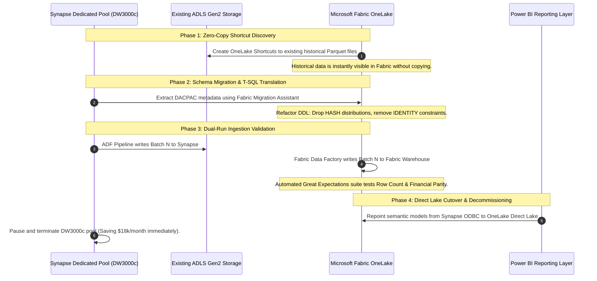
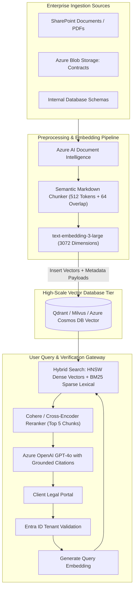
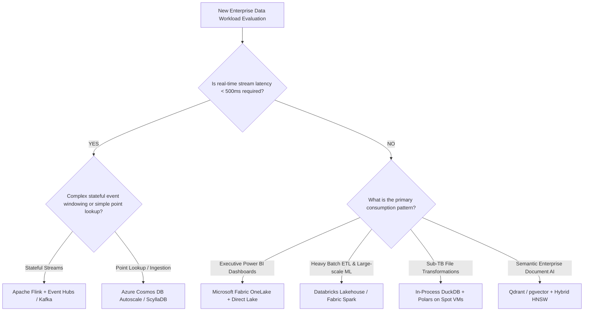

# Module 06: Architectural Practice & Real-World Walkthroughs

## Practice Scenario 1: Global E-Commerce Real-Time Clickstream & Inventory (50TB/Day)

### 1.1 The Business & Technical Problem
A multinational e-commerce retailer processes **50 Terabytes of raw events daily** across web, mobile apps, and physical retail point-of-sale (POS) terminals. 
- **Business Objective**: Real-time fraud detection during checkout ($<50\text{ms}$ SLA), dynamic cart abandonment re-engagement within 5 minutes, and live executive inventory tracking without running batch refreshes.
- **Key Challenges**: Massive traffic spikes during Black Friday ($10\times$ baseline), multi-region inventory consistency, and avoiding high operational cloud bills.

### 1.2 Target Architecture Diagram



### 1.3 End-to-End Architectural Walkthrough
1. **Ingestion Layer**: Ingestion utilizes **Azure Event Hubs (Dedicated Capacity)** with partition count set to 64 to allow parallel consumer scaling. Events are formatted using **Apache Avro** with an enterprise **Schema Registry** to prevent bad-payload poison pills from breaking downstream streams.
2. **Stateful Streaming**: **Apache Flink** operates over a 15-minute sliding window with RocksDB state storage to detect cart abandonment patterns (User added items to cart, visited checkout, but no payment event emitted within 300 seconds).
3. **Operational Serving**: Low-latency customer lookups use **Azure Cosmos DB** configured with Autoscale RU/s and a synthetic partition key (`CountryCode_UserId`).
4. **Analytical Lakehouse**: Streaming data sinks directly into **OneLake** in Delta Parquet format every 60 seconds. Power BI connects via **Direct Lake mode**, providing executives with sub-second inventory visibility without traditional scheduled refreshes.

### 1.4 Failure Modes & Debugging Playbook
- **Failure Mode 1: Kafka Consumer Group Lag Explosion**:
  - *Symptom*: End-to-end event latency increases from 2 seconds to 45 minutes; downstream dashboards show stale data.
  - *Root Cause*: A single slow partition consumer blocked by an unoptimized database call in the Flink map function.
  - *Remediation*: Scale Flink task slots to match partition count ($64$ slots); replace synchronous external calls with Flink **Async I/O** backed by thread pools and circuit breakers.
- **Failure Mode 2: Cosmos DB Hot Partition Throttling**:
  - *Symptom*: High `HTTP 429` error rates during flash sales; checkout latency spikes.
  - *Root Cause*: All flash sale order writes shared a static partition key (`ItemCategory = 'Electronics'`).
  - *Remediation*: Deploy a synthetic partition key appending a randomized integer: `Electronics_0` through `Electronics_9`, distributing write traffic across 10 physical partitions.

---

## Practice Scenario 2: Legacy Synapse Dedicated SQL Pool to Microsoft Fabric Migration

### 2.1 The Problem Statement
A Fortune 500 financial enterprise runs an on-premise migrated warehouse in **Azure Synapse Dedicated SQL Pools (DW3000c)**:
- **Cost**: Costing $\approx \$18,000/\text{month}$ standing 24/7.
- **Pain Points**: Long queue times for executive reports due to concurrency slot exhaustion; high maintenance overhead tuning 60 hash distributions and rebuilding fragmented Columnstore rowgroups.
- **Goal**: Migrate to **Microsoft Fabric** to eliminate DWU maintenance, reduce costs by 50%, and unlock Direct Lake reporting.

### 2.2 Phase-by-Phase Migration Strategy



### 2.3 Production Validation Script (PySpark Reconciliation)
Before decommissioning the Synapse pool, execute automated mathematical reconciliation to guarantee absolute zero data loss:

```python
# Automated Parity Validation between Synapse Dedicated DW and Fabric Lakehouse
from pyspark.sql import functions as F

synapse_df = spark.read.format("synapse") \
    .option("spark.synapse.sql.dw.dataSource", "synapse_prod") \
    .option("spark.synapse.sql.dw.table", "dbo.FactFinancialLedger") \
    .load()

fabric_df = spark.read.table("fabric_lakehouse.gold_financial_ledger")

# 1. Row Count Validation
synapse_count = synapse_df.count()
fabric_count = fabric_df.count()
assert synapse_count == fabric_count, f"Row count mismatch! Synapse: {synapse_count}, Fabric: {fabric_count}"

# 2. Checksum Financial KPI Reconciliation
synapse_agg = synapse_df.groupBy("FiscalYear").agg(
    F.sum("DebitAmount").alias("total_debit"),
    F.sum("CreditAmount").alias("total_credit")
).collect()

fabric_agg = fabric_df.groupBy("FiscalYear").agg(
    F.sum("DebitAmount").alias("total_debit"),
    F.sum("CreditAmount").alias("total_credit")
).collect()

assert synapse_agg == fabric_agg, "Financial metric deviation detected between Synapse and Fabric!"
print("100% Data and KPI Parity Confirmed. Safe for Production Cutover.")
```

---

## Practice Scenario 3: Enterprise GenAI / RAG Platform with Vector Database

### 3.1 The Problem Statement
A global legal and accounting enterprise needs to build a secure, multi-tenant AI copilot:
- **Data Corpus**: 15 million internal PDF contracts, legal briefs, tax filings, and SQL schema documentation stored across SharePoint, Azure Blob, and PostgreSQL.
- **Requirements**: Sub-second search retrieval ($<500\text{ms}$), strict multi-tenant authorization (lawyers can only see files belonging to their assigned matter/client), and zero hallucination.

### 3.2 Target Architecture Diagram



### 3.3 Key Architectural Decisions
1. **Chunking Strategy**: Rather than arbitrary character-based splitting, use **Semantic Structural Chunking** based on document headers (`#`, `##`, `###`), preserving legal clause boundaries intact.
2. **Hybrid Search (Dense + Sparse)**: Pure vector search fails on precise legal citations (e.g., searching for *"Section 14.2(b) of IRS Code 409A"*). A **Hybrid Search** combines dense embeddings with sparse BM25 keyword matching via Reciprocal Rank Fusion (RRF).
3. **Single-Stage Payload Filtering**: Multi-tenancy is enforced directly inside the vector search query:
```json
{
  "filter": {
    "must": [
      { "key": "tenant_id", "match": { "value": "client_enterprise_982" } },
      { "key": "security_clearance", "match": { "value": "LEVEL_3" } }
    ]
  },
  "limit": 10
}
```

---

## 4. Master Architectural Decision Tree & Runbook



### 4.1 Production Debugging Quick-Reference
1. **Synapse Query Hangs at 99%**: Run `DBCC PDW_SHOWSPACEUSED`. Look for rows concentrated in 1 or 2 of the 60 distributions. Re-hash the table on a high-cardinality synthetic key.
2. **Fabric Direct Lake Falls Back to DirectQuery**: Check Power BI capacity metrics. Ensure RLS is handled in the Semantic Model or Warehouse, calculated columns are pre-computed in Spark, and total column count does not exceed model limits.
3. **Cosmos DB HTTP 429 Surge**: Inspect the partition key cardinality. Verify that read queries specify the partition key in the `WHERE` clause to avoid cross-partition query fan-out.
